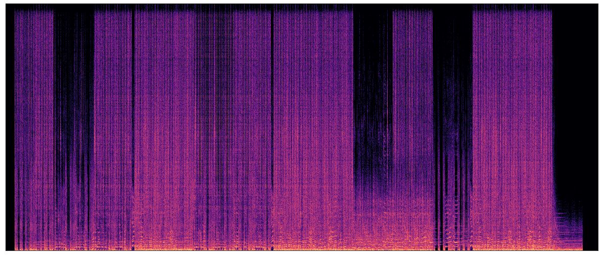

### Hi! My name is Adam Sabra and I am an undergraduate senior at the University of California, Davis.

### My major is in Statistics with a track focus in Machine Learning.

- 🔭 I’m currently working on [my thesis on Blind Source Separation](https://github.com/theadamsabra/Audio-Source-Separation-Undergraduate-Thesis).
- 🌱 I’m currently learning [about Convolutional Neural Networks from Stanford](https://www.youtube.com/playlist?list=PL3FW7Lu3i5JvHM8ljYj-zLfQRF3EO8sYv) for free.
- 💼 I'm currently searching for a full time position after graduation.

My goal is to use the skills and tools in Machine Learning and Deep Learning to pave my own path in audio research.
